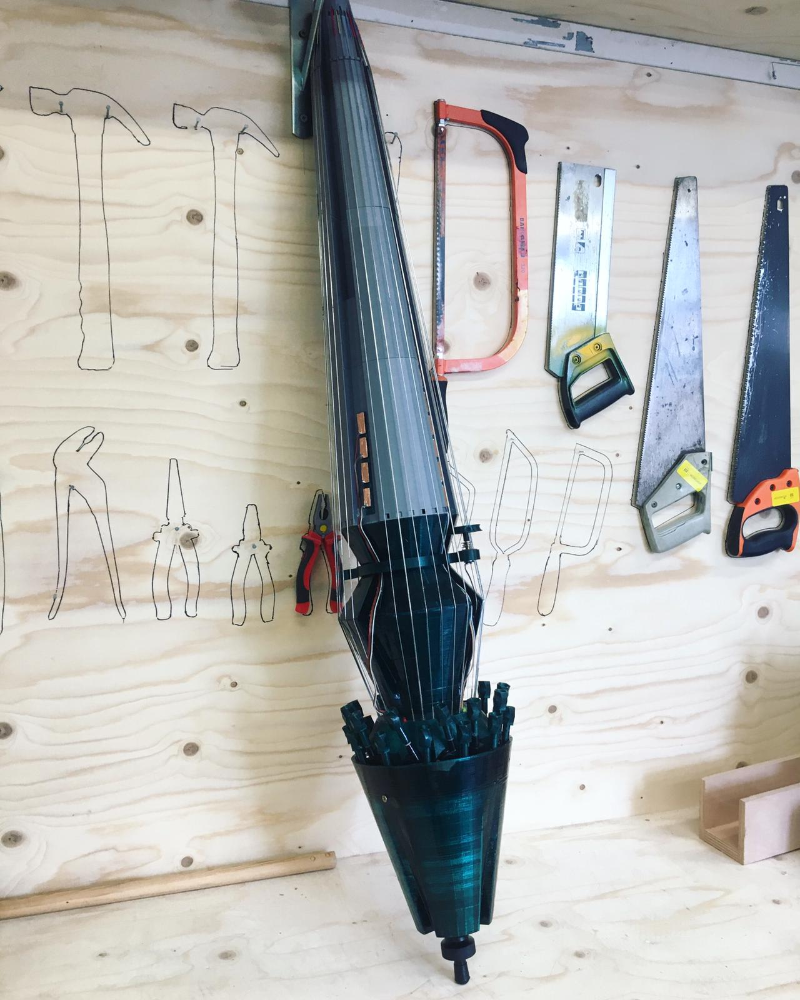

# Knurl

Knurl, an interactive 'cello' with 24 strings (2021), is a shift into exploring the potential of hybrid instruments (acoustic-electronic) to be enhanced by its interaction with audiences. Through built-in electronic components, as well as the potential for music to be a shared endeavor between performers and remote/local audiences, Knurl is generating a new concept of music production, were the borders between listeners, producers and performers become undecipherable. 

Knurl is maintained by Knurl Lab, a non profit organization and laboratory of artistic practices grounded inside an instrument: Knurl, (an hybrid, solar powered and reprogrammable cello) is best conceived not merely as an object but as an ever-evolving exploration for music practices and interfaces, an attempt to enhance a hybrid instrument (acoustic-electronic) by incorporating social practices, sonic concepts, audience engagement and sustainability within the body of the instrument itself. 

[Access Knurl Lab for more info](www.knurl-lab.in)
Contact: rafaeleandrade@tutanota.com

## Supported by: 
Reflow, Stimueliring fonds Industrie, Creative coding Utrecht, Instrument inventors, Stichting de Zaaier, Bela platform, Ifactory 

In this file, you will find:
* Knurl patches 
* versions
* tutorials
* system update

## Before you proceed:  About Code of Practice:
"[…] if you give a man a fish he is hungry again in an hour. If you teach him to catch a fish you do him a good turn." 

We all know this chinese proverb from Tao Zu. Sharing digital content and open scource documentation also means teaching people how to think, not to eat 'fast food'. Our understanding of open scource culture is based on this though: Here, we are teaching people new music practices. Make sure to have fun and tell us your experience with the tutorials and documentation. We hope to hear from you soon!
